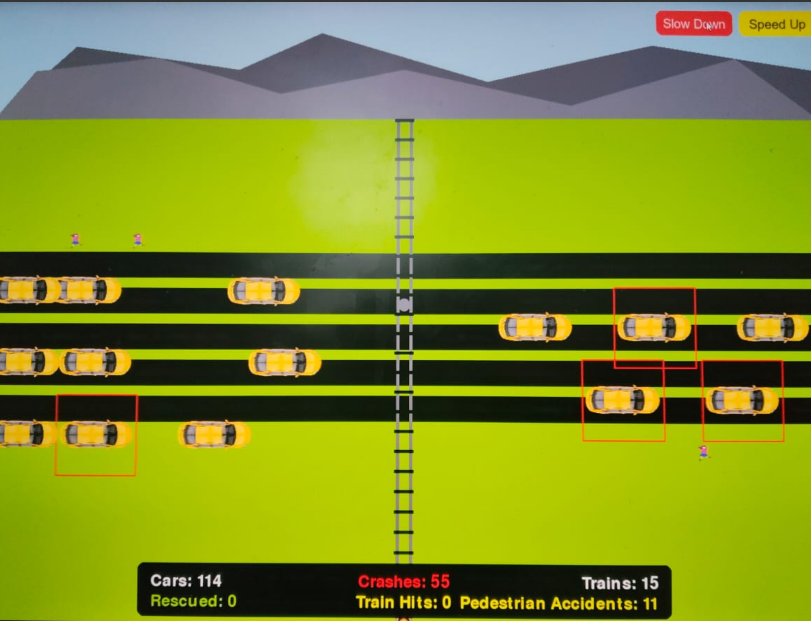

# [Accident Simulator] 🎯

## Basic Details
### Team Name: [SJ]

### Team Members
- Team Lead: [Shahir N] - [Rajiv Gandhi institute of Technology]
- Member 2: [Jackson Shelvi] - [[Rajiv Gandhi institute of Technology]

### Project Description
THE PROJECT PROVIDE A DEMO SIMULATION ON HOW ACCIDENT CAN OCCURS IN A PLACE OF UNSTOPPED TRAFFIC IT IS USELESS AS IT IS NEITHER A REAL LIFE THING NOR A LOGICAL ONE .

### The Problem (that doesn't exist)
STIMULATED VIOLENCE

### The Solution (that nobody asked for)
PROVIDING A SIMULATION OF VIOLENCE SHAKING

## Technical Details
### Technologies/Components Used
For Software:
- Python

### Implementation
For Software:
# Installation
[commands]

# Run
[commands]

### Project Documentation
For Software:

# Screenshots (Add at least 3)
### Demo Images

# Diagrams

*Add caption explaining your workflow*

For Hardware:

# Schematic & Circuit

*Add caption explaining connections*

*Add caption explaining the schematic*

# Build Photos

*List out all components shown*

*Explain the build steps*

*Explain the final build*

### Project Demo
# Video
[Add your demo video link here]
*Explain what the video demonstrates*

# Additional Demos
[Add any extra demo materials/links]

## Team Contributions
- [SHAHIR N]: [Specific contributions]
- [JACKSON SHELVI]: [Specific contributions]
- [Name 3]: [Specific contributions]

---
Made with ❤️ at TinkerHub Useless Projects 

