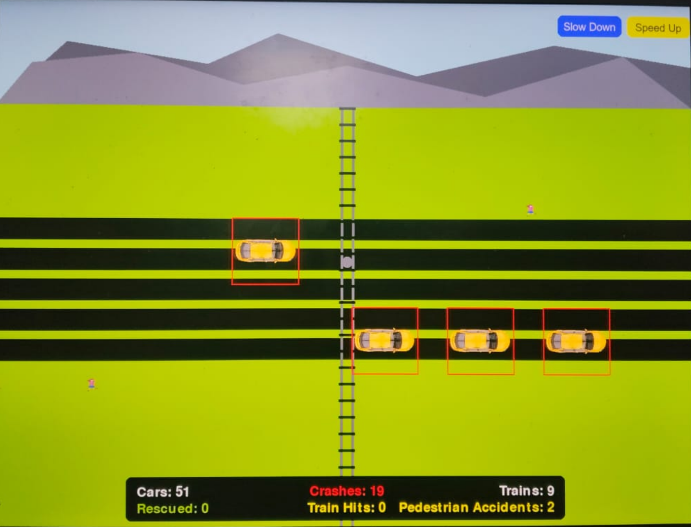
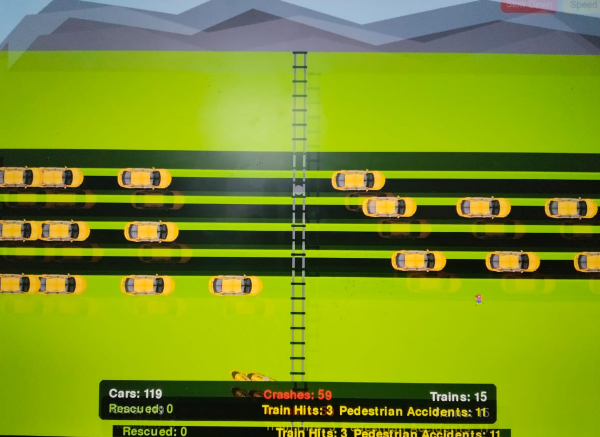

# [Accident Simulator] 🎯

## Basic Details
### Team Name: [SJ]

### Team Members
- Team Lead: [Shahir N] - [Rajiv Gandhi institute of Technology]
- Member 2: [Jackson Shelvi] - [[Rajiv Gandhi institute of Technology]

### Project Description
THE PROJECT PROVIDE A DEMO SIMULATION ON HOW ACCIDENT CAN OCCURS IN A PLACE OF UNSTOPPED TRAFFIC IT IS USELESS AS IT IS NEITHER A REAL LIFE THING NOR A LOGICAL ONE .

### The Problem (that doesn't exist)
STIMULATED VIOLENCE

### The Solution (that nobody asked for)
PROVIDING A SIMULATION OF VIOLENCE SHAKING

## Technical Details
### Technologies/Components Used
For Software:
- Python

### Implementation
For Software: python compiler

# Screenshots (Add at least 3)
### Demo Images

## Team Contributions
- [SHAHIR N]: [MAIN TECHNICAL]
- [JACKSON SHELVI]: [MAIN IDEATER]
- [Name 3]: [Specific contributions]

---
Made with ❤️ at TinkerHub Useless Projects 

